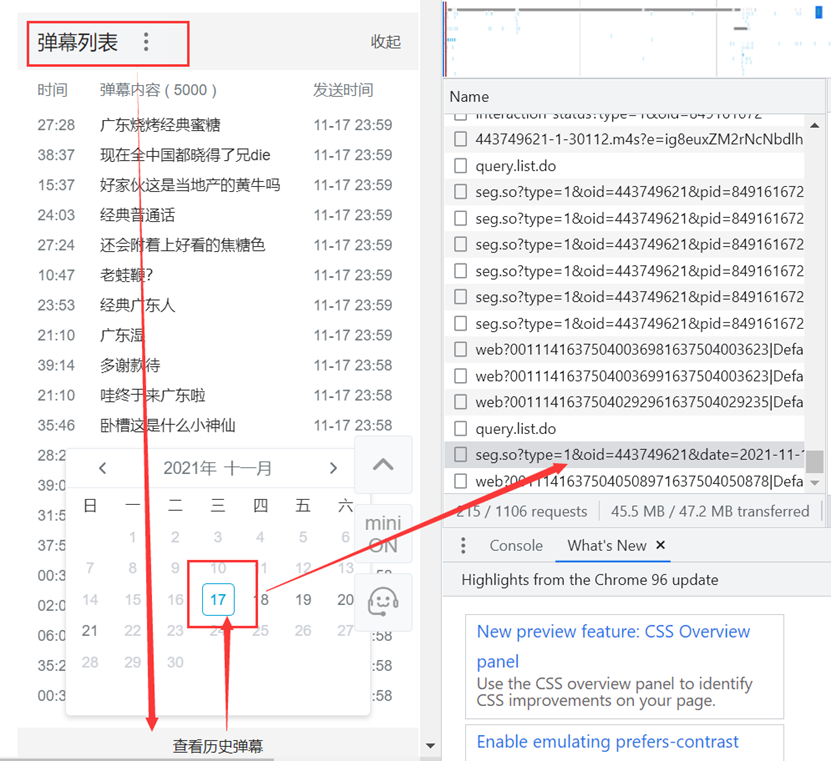
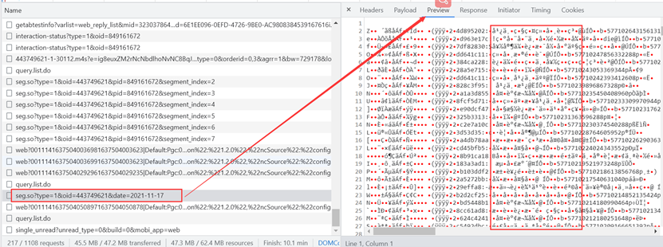
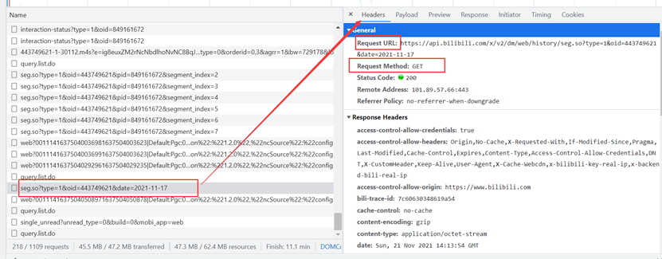
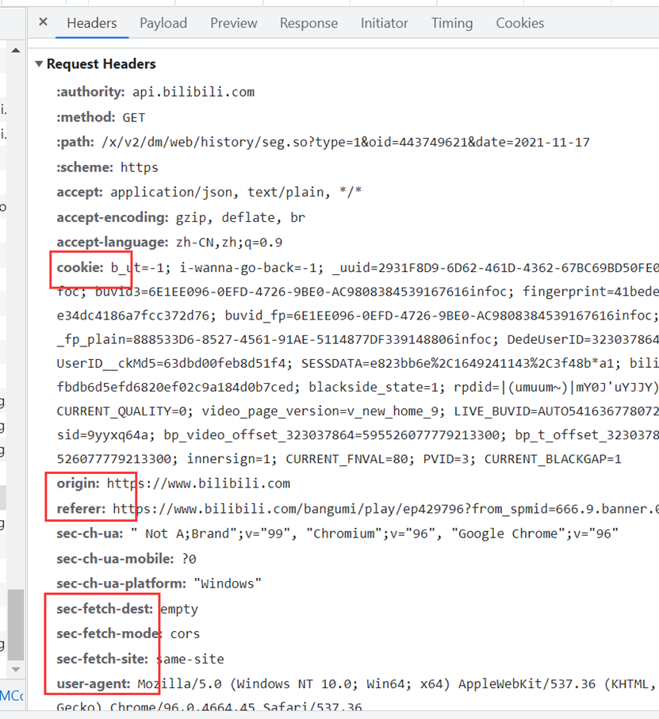
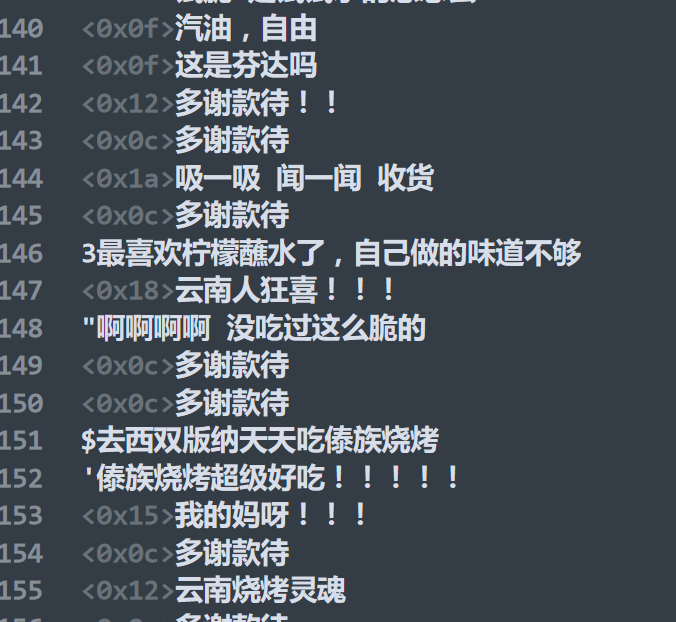
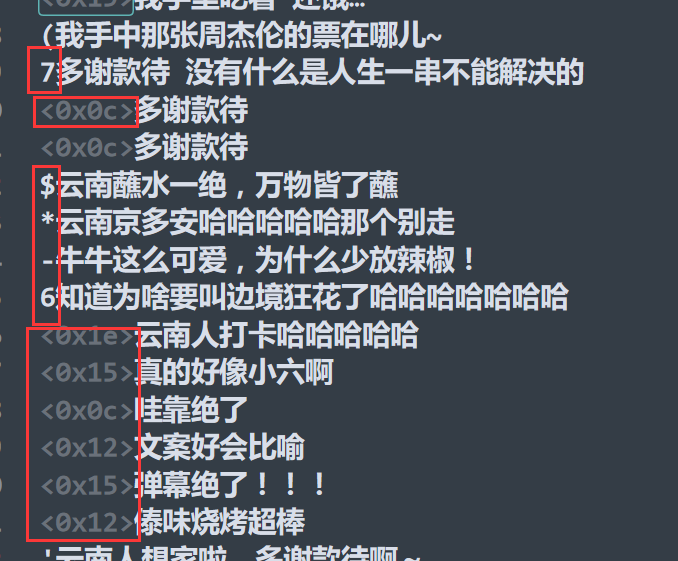
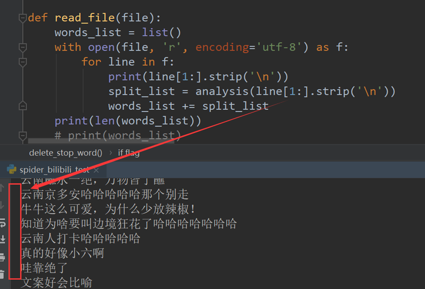
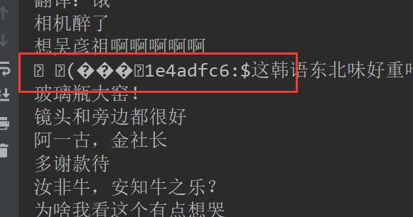

# bilibili-barrage
简单爬取B站弹幕
bilibili弹幕简单爬取以及词云的生成，主要参考博客文章[`https://blog.csdn.net/weixin_38753213/article/details/109554851`](https://blog.csdn.net/weixin_38753213/article/details/109554851)，有修改

主要分为三个部分：

+ 网页分析
+ 数据爬取
+ 生成词云

### 网页分析

首先打开bilibili网站，在账号登录后，选择其中的一个视频打开，这里我们选择的是纪录片《人生一串3》中的第一个视频

 

然后我们打开开发人员工具（键盘`F12`），找到和弹幕相关的网页



这里我们看到预览信息中的文本像是乱码（网上有人分析应该是B站反扒机制），原来以为不能做分析，后面爬取后发现还是可以`UTF-8`看到弹幕，只是要稍作处理



于是我们可以从得到了弹幕链接`https://api.bilibili.com/x/v2/dm/web/history/seg.so?type=1&oid=443749621&date=2021-11-17`，从URL中可以看出，一共有三个参数，分别是`type`、`oid`和`date`，显然我们需要获取当前视频下的所有弹幕，只需要改变`date`参数即可



同时我们还可以看到请求头中的更多参数，比如`cookies`，这有助于我们在代码中构建一个请求头



网页分析到此结束，现在我们进行下一步

### 数据爬取

我们通过上一步的网页分析可以得到很多的信息，数据爬取的代码编写可以用到这些信息。首先我们构建一个网页请求，然后得到整个网页文本数据，从网页文本数据中通过正则匹配得到我们需要的弹幕文件数据并保存，这就是我们数据爬取需要做的工作。

这里我们通过网页的分析，首先构造一个URL

```python
# 伪造请求头
headers = {
    'sec-fetch-dest': '...',
    'sec-fetch-mode': '...',
    'sec-fetch-site': '...',
    'origin': '...',
    'referer': '...',
    'cookie': "...",
    'user-agent': "..."
}
# 构造url访问 需要用到的参数
params = {
    'type': 1,
    'oid': '...',
    'date': date
}
# 发送请求 获取响应
response = requests.get(url, params=params, headers=headers)
response.encoding = 'utf-8'
```

上面代码中`...`所表示的内容就是网页分析中可以查到的参数内容，从网页中复制过来即可。

获得网页文本数据后，我们通过正则表达式提取我们所需要的数据

```python
comment = re.findall("(?<=:).*?(?=@)", response.text)
```

这个地方的正则表达式`(?<=:).*?(?=@)`表示的就是获取`:`和`@`中间的数据，即弹幕内容数据，因为通过观察可以看到弹幕内容都包含在这两个字符中间。这里注意提取的内容中第一个字符还是乱码，后续会将其处理掉。当然，还有其他许多方式可以提取弹幕，这里留待改进。


提取后保存的文本数据如下图所示



这里就可以看到，在所有的弹幕数据前面都有一个乱码字符



我们通过代码去掉首字符，得到我们需要的文本，这里注意的是弹幕内容本身就包含一些乱码字符，这里暂时忽略这些字符





### 生成词云

通过获取的弹幕文本数据，这里使用`jieba`进行分词，首先我们先去掉一些大量的符号内容（当然也可以不删除，只是后面分词计算的时候会把这些符号一起计算进去）

```python
def delete_stop_word(words_list):
    stop_word = ['!', '，', '！', '？', '�']
    flag = False
    for w in words_list:
        if w in stop_word:
            flag = True
            words_list.remove(w)
    if flag:
        # print("删除停用词")
        pass
    return words_list
```

去掉这些符号后进行分词统计

```python
word_counts = collections.Counter(all_words)
word_counts_top100 = word_counts.most_common(100)
print(word_counts_top100)
```

最后使用`pyechart`生成词云


### 后记

1. 爬取弹幕的方式有很多，这里只是一种方式
2. 弹幕内容的提取，这里是比较简单的提取方式，使用的是正则表达式，还有一些就是网页分析的包可以利用
3. 待记

@Date : 2021/11/22

@Author : [Freator Tang](https://github.com/Freator)

@Email : [bingcongtang@gmail.com](mailto:bingcongtang@gmail.com)
